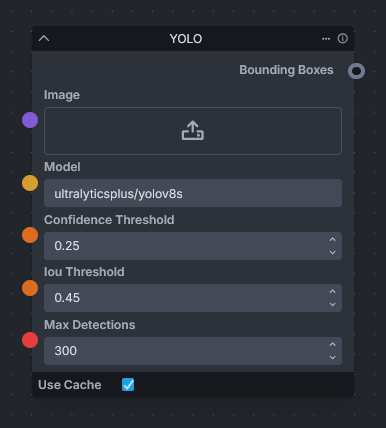

# YOLO



The "YOLO" provides a seamless solution for object detection in images, leveraging the power of the ultralyticsplus package. This node integrates state-of-the-art YOLOv8 models, which are widely recognized for their speed and accuracy in identifying and localizing multiple objects within an image.

To make use of this node, users need to perform a one-time setup by opening the developer's console in InvokeAI and installing the `ultralyticsplus`  package using the provided pip command:

```bash
pip install ultralyticsplus
```